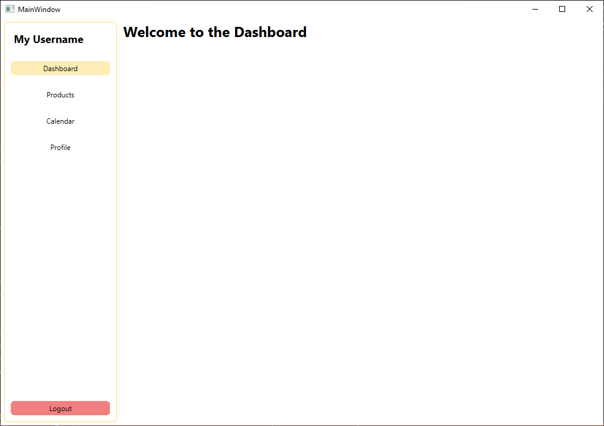

# TobaccoManager


TobaccoManager is a WPF application for managing tobacco-related workflows. This project features a modern UI and includes authentication screens and a custom icon.

## Features
- User authentication (Login, Signup, Account Recovery)
- Clean and modern interface
- Custom leaf icon


## Planned Structure
```css
[Views]
 ├── [Auth]
 │    ├── LoginPage.xaml
 │    ├── RegisterPage.xaml
 │    └── RecoverPage.xaml
 │
 └── [Dashboard]
      ├── Dashboard.xaml
      ├── Products.xaml
      ├── Calendar.xaml
      └── Profile.xaml


```
<!-- ```css
 │    └── [Components]
 │         ├── SummaryCard.xaml
 │         ├── ChartWidget.xaml
 │         └── NotificationsPanel.xaml
 │
 ├── [Management]
 │    ├── AssetsPage.xaml
 │    ├── SalesPage.xaml
 │    ├── SuppliersPage.xaml
 │    └── CustomersPage.xaml
 │
 ├── [Reports]
 │    ├── ReportsPage.xaml
 │    └── ExportDialog.xaml
 │
 └── [Settings]
      └── SettingsPage.xaml
``` -->

## Screenshots

### Login


### Signup


### Account Recovery


### Dashboard



## Getting Started
1. Clone the repository.
2. Open `TobaccoManager.sln` in Visual Studio.
3. Build and run the project.

## Assets
All screenshots and icons are located in the `Assets/Screenshots/` directory.

