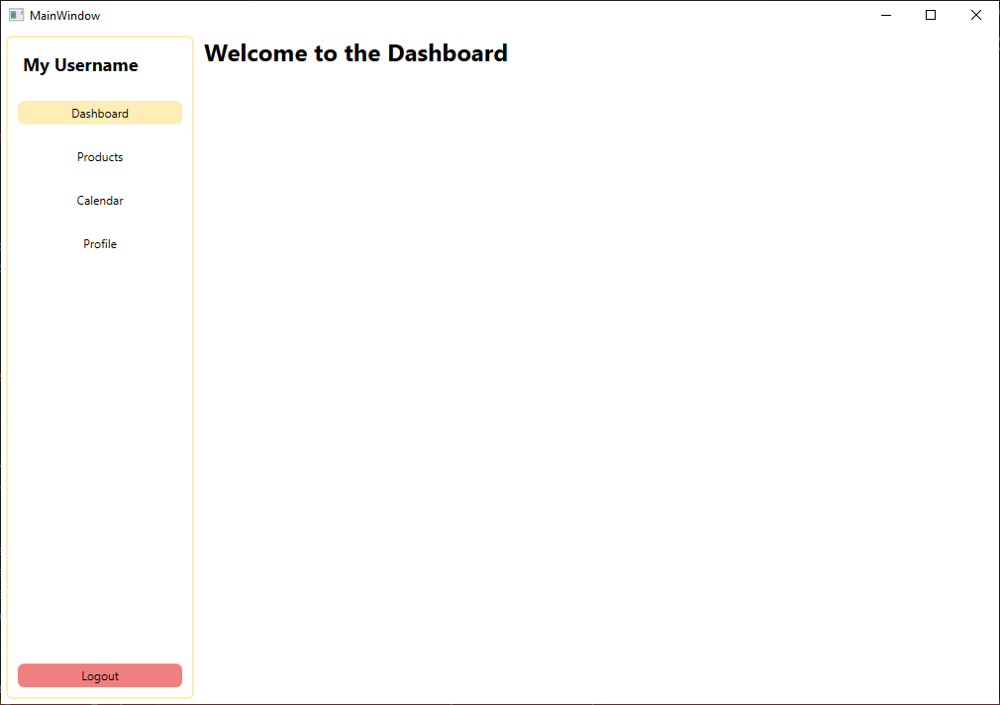

# TobaccoManager


**TobaccoManager** is a WPF desktop application for managing tobacco stock, customers, and user authentication. It features a modern UI built in XAML and uses **Entity Framework Core** with **SQLite** for data persistence.

---

## 🚀 Features

- 🔐 User Authentication (Login, Register, Password Recovery)
- 📦 Stock and Bundle Management
- 🧾 Customer Tracking with Quota Agreements
- 📅 Calendar view of stock and quota-agreement dates
- 👤 Profile page for editing account details and password
- 🌿 Clean and modern interface with custom icons

---

## 📁 Project Structure

```css
[Models]
 ├── Users.cs
 ├── Customers.cs
 └── Stocks.cs  // Also contains the Bundle() class

[Views]
 ├── [Auth]
 │    ├── LoginPage.xaml
 │    ├── RegisterPage.xaml
 │    └── RecoverPage.xaml
 │
 └── [Dashboard]
      ├── Dashboard.xaml
      ├── Products.xaml
      ├── Calendar.xaml
      └── Profile.xaml
````

<!-- Future View Modules:
 ├── [Management]
 │    ├── AssetsPage.xaml
 │    ├── SalesPage.xaml
 │    ├── SuppliersPage.xaml
 │    └── CustomersPage.xaml
 │
 ├── [Reports]
 │    ├── ReportsPage.xaml
 │    └── ExportDialog.xaml
 │
 └── [Settings]
      └── SettingsPage.xaml
-->

---

## 🗃️ Database

TobaccoManager uses **SQLite** with **Entity Framework Core**.

To install the required EF Core packages, run:

```csharp
dotnet add package Microsoft.EntityFrameworkCore
dotnet add package Microsoft.EntityFrameworkCore.Sqlite
dotnet add package Microsoft.EntityFrameworkCore.Design
dotnet add package Microsoft.EntityFrameworkCore.Tools

# Optional: Install EF CLI globally
dotnet tool install --global dotnet-ef
```

📄 **Database Schema & Models:**
Refer to [`Assets/Markdown/Database`](Assets/Markdown/Database.md) for a complete description of database entities, relationships, and access patterns.

---

## 📦 Model Overview

| Entity     | Description                                   |
| ---------- | --------------------------------------------- |
| `User`     | Handles authentication and roles (admin/user) |
| `Customer` | Represents customer data                      |
| `Stock`    | Records of stock received                     |
| `Bundle`   | Bundle details (weight, grade, price per kg)  |

> Full schema tables and C# access examples are available in the [Database Reference](Assets/Markdown/Database.md).

---

## 🖼️ Screenshots

### 🔐 Login


### 📝 Signup


### 🛠️ Account Recovery


### 📊 Dashboard



---

## ⚙️ Getting Started

1. Clone the repository:

   ```bash
   git clone https://github.com/your-username/TobaccoManager.git
   ```

2. Open the solution file:
   `TobaccoManager.sln` in Visual Studio

3. Restore packages and build the project:

   ```bash
   dotnet restore
   dotnet build
   ```

4. Run the application from Visual Studio or via CLI:

   ```bash
   dotnet run --project TobaccoManager
   ```

---

## 📁 Assets

All screenshots and icons are located in the [`Assets/Screenshots/`](Assets/Screenshots/) directory.

---

## 📘 Documentation

* 📄 [Database Structure & Access Patterns](Assets/Markdown/Database.md)
* 🔧 Coming soon: Usage Guide and Architecture Overview

---

## 📝 License

No license used yet.
<!-- This project is open-source under the [MIT License](LICENSE). -->


